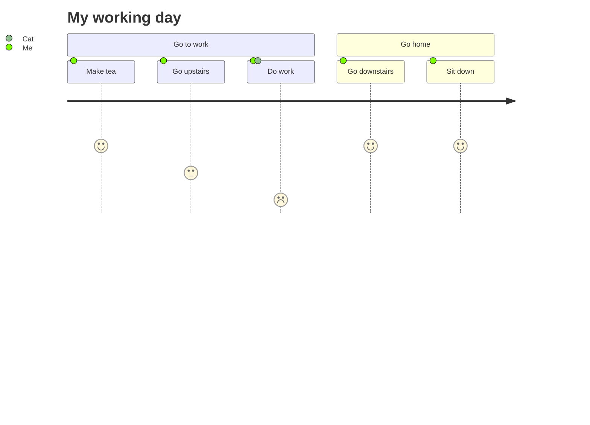

- ## Syntax Highlighting (with Prism)

```javascript
import React from "react"
import Header from "./header"

  return (
    <>
      <Header title={title} />
      <main role="main" className="container mt-3">
        {children}
      </main>
    </>
  )
}
```

- ## Mermaid graphs and diagrams

**Markdown input:**

<pre>


</pre>

**Output**:


